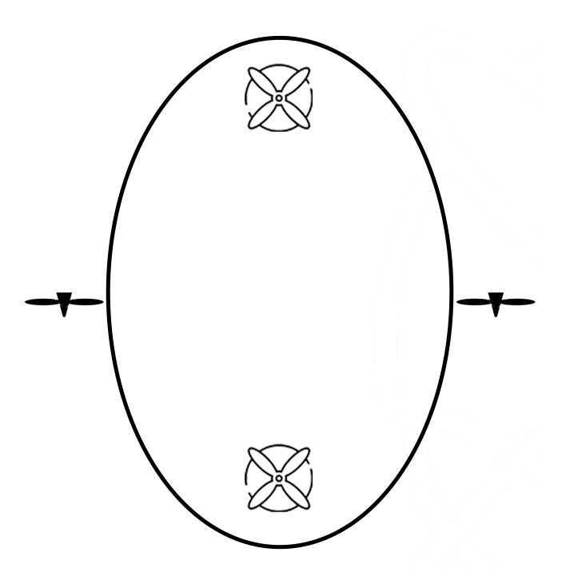

# Tutorial

This is a tutorial for our IU volunteers.

In the competition, your job is mainly to control blimps and together, as a team, win the competition. Therefore, you are not just a volunteer to us, but also this makes you a part of this team. As main crew member of this team, I would like to say thank everyone for your helps and efforts.  

## Content

- [1 Prerequisite](#1-Prerequisite)
- [2 Software setup](#2-Software-setup)
- [3 Airship introduction](#3-Airship-introduction)
- [4 Game controller introduction](#4-Game-controller-introduction)

## 1 Prerequisite

Prerequisite is something you should finish before you show up on. 

- You'll need to bring your **laptop** with **windows 10** or **Linux ubuntu 20 or ubuntu 18**. (We haven't tested MacOS but if that is your only laptop, then follow the tutorial first and if you encounter any problems, we will figure it out on Monday)

  - If your laptop has only type-c interface, then please also bring your 'type-c to USB' converter, we can't offer that.   

- python 3 

  - If you don't have python 3 on your laptop, I will strongly recommend to install [Anaconda](https://docs.anaconda.com/anaconda/install/), it will make your life easier, especially for beginners. 

- [Arduino IDE](https://www.arduino.cc/en/software)

- pygame library

  - Use one of the following commands:

    ```
    pip install pygame 
    pip3 install pygame
    ```

- pyserial library:

  - Use one of the following commands:

    ```
    pip install pyserial
    ```

- To use the code, please clone our git repo a head of time. We will continue to uploading our git, so please pull that latest update by tomorrow morning. 

  - To clone our code, open your terminal in a folder where you want to store it and type the following commands:

    ```
    git clone https://github.com/zhz03/Tutorial-Controlling-multiple-control-boards-through-game-controllers
    ```

## 2 Software setup

### Step 1: Installing Arduino IDE Software

Install Arduino IDE software from the link http://www.arduino.cc/en/main/software

### Step 2: Installing Arduino Core for NodeMCU ESP-12E Using Arduino Boards Manager

- Start Arduino and open Preferences window
- Enter http://arduino.esp8266.com/stable/package_esp8266com_index.json into Additional Board Manager URLs field. You can add multiple URLs separating them with commas.

- Open Boards Manager from Tools > Board menu and install _esp8266_ platform.
- Select ESP8266 board from Tools > Board menu after installation.


### Step 3: Connectign NodeMCU to the PC


Now Let’s connect the ESP8266 module to your computer through USB cable as shown in the figure. When module is connected to the USB, COM port is detected eg: here COM5 is shown in the figure.


### for MacOS users

Please down load the Mac drivers for NodeMCU ESP8266 using the link:
[Silcon Labs CP210x USB to UART Bridge](https://www.silabs.com/products/development-tools/software/usb-to-uart-bridge-vcp-drivers)

Once installed, plug in the NodeMCU and check the port /dev/tty.SLAB_USBtoUART exists.

### Step 4: Uploading the program to ESP8266 module

The code will be provided and you can click on the right arrow shown in the figure to upload the program to the module. 


## 3 Airship introduction

In the competition, we will have two different types of airship: attackers and defenders. 

### Attacker airship

The attacker is a fish shape balloon and it contains:

- 4 motors + propellers to provide thrust 
- A FPV camera to give you the first-person-view
- A capture mechanism to catch the Neutral buoyancy ball (goal)
- A fish shape balloon

Your job is to control the motors of the attacker airship using the game controller that we provide to catch the goal and put it into the other team's hula hoop.

The bottom view of the attacker is shown in the figure:



Two motors on the side are to control the horizontal movement: forward, backward, turn left turn right

Two motors one the bottom are to control the vertical movement: up, down, (some attackers can also control the head-up or tail-up, not all of them can)

The speed of these motors can also be controlled: 50% (normal speed), 100% (full speed)

### Defender airship

The defender airship is the special kind. it contains:

- 4 or 3 motors + propellers
- A net that can block an opponent's attackers (at the middle)
- 2 spherical balloons (one at the top, the other one is at the bottom)

The defender will hover in front of our hula hoops to prevent our opponents from getting scores.

The control of our defender airship is almost as same as our attacker. 

## 4 Game controller introduction

In the competition, we will use the XBox game controller to control our airships. The illustration figure of game controller is shown in the figure:

 

The corresponding mapping between game controller and function of the airship is in the following table:

| Game controller                                            | Airship functions                        |
| ---------------------------------------------------------- | ---------------------------------------- |
| Left stick ($\uparrow,\downarrow,\leftarrow,\rightarrow$)  | forward, backward,turn left, turn right  |
| Right stick ($\uparrow,\downarrow,\leftarrow,\rightarrow$) | Go up, go down, head up, tail up         |
| left bumper (LB)                                           | 50% speed                                |
| Right bumper (RB)                                          | 100% full speed                          |
| A,B,X,Y                                                    | switch control between different airship |

According to our discussion, one can control at most 2 airships, which means that you'll only switch between button A and button B. 

