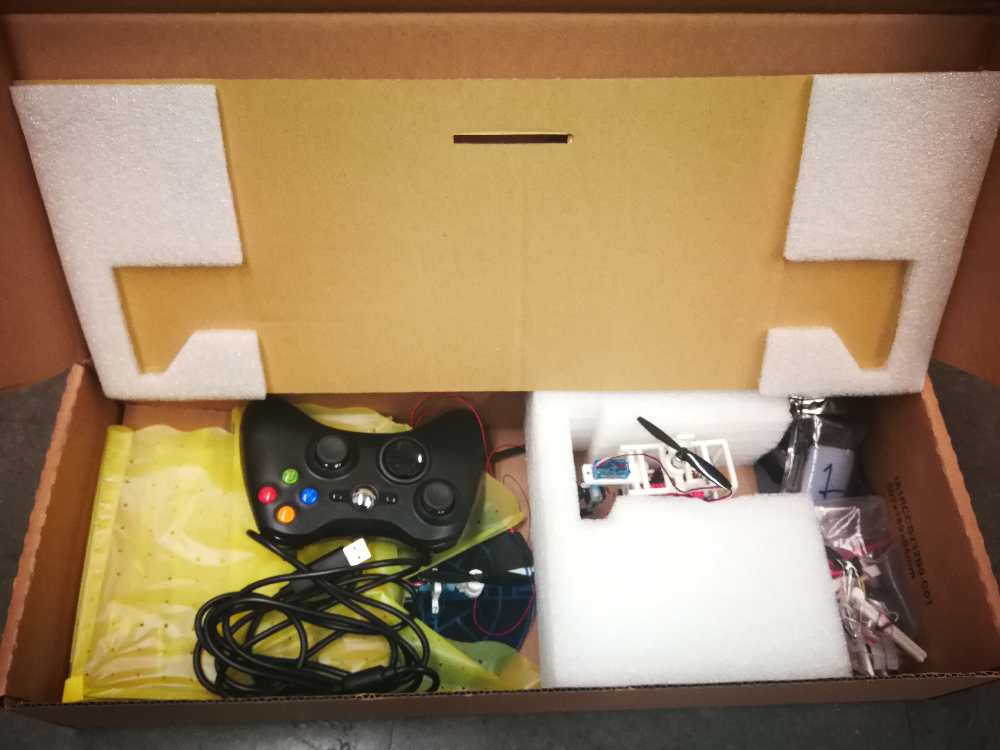
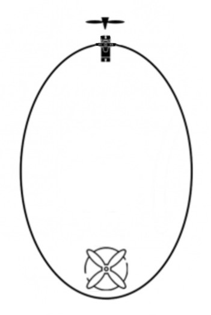

# Tutorial 2

This is a tutorial for the April competition.

In the competition, your job is mainly to control blimps and together, as a team, win the competition. Therefore, you are not just a volunteer to us, but also this makes you a part of this team. As main crew member of this team, I would like to say thank everyone for your helps and efforts.  

## Content

- [1 Prerequisite](#1-Prerequisite)
- [2 Software setup](#2-Software-setup)
- [3 Airship introduction](#3-Airship-introduction)
- [4 Game controller introduction](#4-Game-controller-introduction)

## 1 Prerequisite

Prerequisite is something you should finish before you show up on. 

- You'll need to bring your **laptop** with **windows 10** or **Linux ubuntu 20 or ubuntu 18**. (We haven't tested MacOS but if that is your only laptop, then follow the tutorial first and if you encounter any problems, we will figure it out on Monday)

  - If your laptop has only type-c interface, then please also bring your 'type-c to USB' converter, we can't offer that.   

- python 3 

  - If you don't have python 3 on your laptop, I will strongly recommend to install [Anaconda](https://docs.anaconda.com/anaconda/install/), it will make your life easier, especially for beginners. 

- pygame library

  - Use one of the following commands:

    ```
    pip3 install pygame
    ```

- pyserial library:

  - Use one of the following commands:

    ```
    pip3 install pyserial
    ```

- To use the code, please clone our git repo a head of time. We will continue to uploading our git, so please pull that latest update by tomorrow morning. 

  - To clone our code, open your terminal in a folder where you want to store it and type the following commands:

    ```
    git clone https://github.com/zhz03/Tutorial-Controlling-multiple-control-boards-through-game-controllers
    ```

- Enter that directory: `cd Tutorial-Controlling-multiple-control-boards-through-game-controllers`

- **For MacOS users**: `git checkout mac`

## 2 Software and hardware setup

To control the corresponding blimp. There are three things need to do: 

1. Plug the game controller into your laptop
2. Plug the esp32 receiver to your laptop
3. Run the joystick.py program

Then you should be able to control the blimp. 

### for MacOS users

Please down load the Mac drivers for NodeMCU ESP8266 using the link:
[Silcon Labs CP210x USB to UART Bridge](https://www.silabs.com/products/development-tools/software/usb-to-uart-bridge-vcp-drivers)

Once installed, plug in the NodeMCU and check the port /dev/co.SLAB_USBtoUART exists.

Also install:

https://github.com/360Controller/360Controller/releases/download/v1.0.0-alpha.6/360ControllerInstall_1.0.0-alpha.6.dmg

## 3 Airship introduction

In the competition, we will have a ready-to-go box, which is shown in the following figure: 



The check list can be found in [here]()

The bottom view of our blimp is shown in the figure:



## 4 Game controller introduction

In the competition, we will use the XBox game controller to control our airships. The illustration figure of game controller is shown in the figure:

 

The corresponding mapping between game controller and function of the airship is in the following table:

| Game controller                                            | Airship functions                                 |
| ---------------------------------------------------------- | ------------------------------------------------- |
| Left stick ($\uparrow,\downarrow,\leftarrow,\rightarrow$)  | forward, backward,turn left, turn right           |
| Right stick ($\uparrow,\downarrow,\leftarrow,\rightarrow$) | Go up, go down, head up, tail up                  |
| left bumper (LB)                                           | 50% speed                                         |
| Right bumper (RB)                                          | 100% full speed                                   |
| Y                                                          | To set searching camera back to forward position  |
| X,Y                                                        | To turn the searching camera to the left or right |
|                                                            |                                                   |


